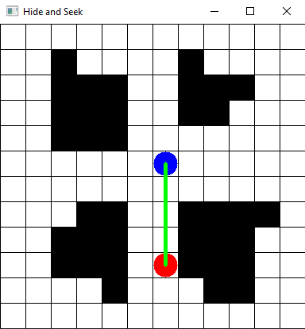
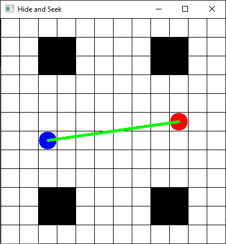
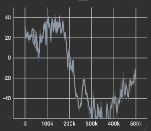
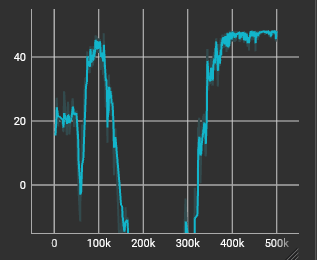
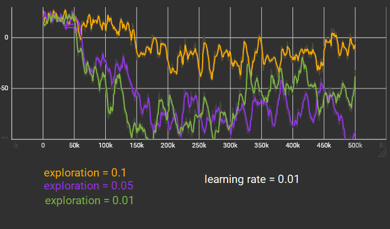
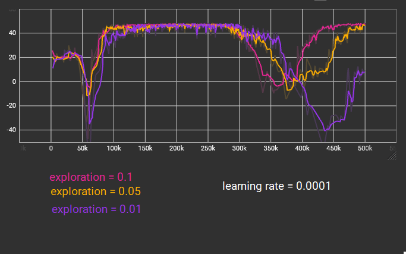

# Hide and Seek

This repository contains my attempt to create an AI trying to hide from a player using Stable Baselines 3. The goal is to create an AI able to hide with the most realistic behaviour. The AI is trained using reinforcement learning, and more specifically using the Deep Q-Learning (DQN).



In the following, I will explain the rules of the game, how to deploy and reproduce results, the architecture of the project, and my notes on the building of this AI. Limitations are also included in the end of the README.


## Rules
The player is in red and the agent is in blue. In play mode (for testing purpose), the player is controlled with ZQSD keys and the agent is controlled with the IJKL keys. A line between the player and the agent indicates if the agent is seen or not. The line is green if the agent is seen, and red if the agent is hidden. The vision algorithm is just a line drawing algorithm inspired from [this article from RedBlobGames](https://www.redblobgames.com/grids/line-drawing.html).

Two maps are pre-defined:
- "statement" :

- "few_walls" :


The other maps are randomly generated by placing randomly walls on a grid. For instance:


## How to deploy and reproduce results

### Requirements
- stable_baselines3 v2.0.0a13
- gymnasium 0.28.1
- tensorboard 2.13.0
- opencv_python==4.7.0.72

Tested with python 3.9.2.

### Installation

Clone the project and install the requirements:

```bash
git clone https://github.com/mguy02/hide_and_seek.git
cd hide-and-seek
pip install -r requirements.txt
```

### Training

Run the following command to train the different AI models:

```python
python batch_training.py
```
This will save the models in the `models` folder.

### Evaluation

Run the following command to evaluate the different AI models:

```python
python batch_evaluation.py
```
The evaluation of each model will be printed to the console.

### See the AI play

Run the following command to see the AI play:

```python
python load.py models/<model_name>
```
where `<model_name>` is the name of the model you want to see play. For example:

```python load.py models/DQN_1686947167_ImmediateSuroundingsObservation
```

## Architecture

The project contains two main files:
- `Game.py` contains the game logic and the rules of the game. It is possible to run it with `python Game.py` to play the game manually. The player is controlled with ZQSD keys and the agent is controlled with the IJKL keys.
- `HideAndSeekEnv.py` contains the gymnasium environment. It contains an instance of the `Game` class and defines the observation space, action space, rewards, termination condition and truncation condition of the environment in which the AI will learn.

The other files are scripts using stable baselines 3 to train and evaluate the AI.

## Notes on the building of this AI

Below are notes explaining all my thoughs that led to the building of this Hide and Seek AI.

While getting used to stable baselines 3 (SB3) and gymnasium libraries, I first tried to make a basic AI to see the learning process. 

Reinforcement learning (RL) environments must define five things:
- the action space: the actions the agent can make. In our case there are four actions (go UP, LEFT, DOWN, or RIGHT)
- the observation space: what the agent can see, the information it has to learn the task. Give not enough or way too much information and it will be hard or impossible for the AI to learn anything. 
- a termination condition: when the task is considered done. In our case, the task is done when the agent is hidden from the player.
- a truncation condition: when the task is considered failed. In our case, the task is failed after 300 steps.
- the reward given to the agent: the reward is the information given to the agent to tell him if he is doing good or not. The agent will try to maximise the reward. In our case, the reward is 50 if the agent is hidden (win), -1 for each step (to encourage the agent to finish the task quickly) if seen by the player.

The action space is fixed by our task. However, we can decide how we want to define our observation space. In other terms, **what information do we want to give to our AI?**. This way we can try to have our expected behaviour of hiding from the player..

### Learn to run away (`BasicObservation`)

The basic observation space that we can define is give the AI the minimum of information possible:
- the player position (x,y) on the grid
- the agent position (x,y) on the grid
- is the agent seen or not (0 or 1)

This observation space is of shape `(5,)`.

This way, the AI can learn to run away from the player. However, it will just happend to be hidden "by chance" by trying to escape from the player. It will not really learn to hide on purpose. Indeed, the AI has yet no knowledge of the map, and more particularly of the walls. It will just try to run away from the player, and if it happens to be hidden, it will be a coincidence:

<!-- GIF of AI with Basic Observation strategy -->


### Learn to hide (`ImmediateSurroundngsObservation`)
In order to improve the previous AI, it is possible to give more information to the AI. We can give it the information of the immediate surroundings of the agent. This way, the AI can see if the surroundings contain walls and will learn to move differently if there are wall nearby or not.

The observation space is now the same as before but with the addition of:
- is the surrounding cell (including diagonals) a wall or not (0 or 1)

(Although the AI cannot move diagonally, it can still see if there is a wall in the diagonal cell, to help planning a path).

This observation space is of shape `(5+8,)`.

<!-- Image of AI + observation space -->


Now we can observe that the agent is more actively trying to hide. It will not just run away from the player, but may turn directly when encountering walls on the surroundings:

<!-- GIF of AI with Immediate Surroundings Observation strategy -->


This strategy however has some limitations. The AI will not be able to properly hide in maps with walls/hiding places that are far away, as they won't be in the immediate surroundings. The AI will not be able to plan a path to go to these places. It will just try to run away from the player, and if it happens to be close to a wall, it will be a coincidence:

<!-- GIF of AI with Immediate Surroundings Observation strategy on map few_walls-->


### Learn to hide by seeing (`LongViewObservation`)

The problem with the previous observation space is that the AI is short-sighted. It can only see the immediate surroundings. It cannot plan a path to go to a far away wall. To tackle this problem, the agent must see more of the environment. Instead of seeing the surroundings of size X, to not have a big dimension of the observation space, the agent will see in straight lines in 8 directions. This can be seen as sensors that give proximity info to the AI.

The observation space is now:
- the player position (x,y) on the grid
- the agent position (x,y) on the grid
- is the agent seen or not (0 or 1)
as before, but with the addition of:
- for each 8 directions, is there a wall at size 1, 2, ..., view_size (0 or 1)

This observation space is of shape `(5+8*view_size,)`.

If view_size = 1, this is equivalent to the `ImmediateSurroundngsObservation` strategy. By default, this strategy is set to view_size = 5.

<!-- Image of AI + observation space with view_size = 5 -->


Now, in maps with walls that can be far away, the agent will be able to "sense" them and plan where to hide:

<!-- GIF of AI with Long View Observation strategy on map few_walls-->


## Training reward mean

Below are plots from tensorboard of the mean reward (y-axis) of the training over timesteps (x-axis). **Mind the different y-axis scale between the graphs.**
### Basic Observation


### Immediate Surroundings Observation


### Long View Observation





The most successful AI is the one with learning rate = 0.001 with exploration = 0.1. But this is evaluated only on the training map. This could be just overfitting. On the next section, we will evaluate the AI on other maps to see if it it learnt anything.

## Results of batch evaluation

<!-- Table of the results -->

The AI trained on the "statement" map are evaluated over 1000 episodes over the "few_walls" and "random" maps.  **For clarity, only the LongViewObservation with learning rate = 0.001 and exploration = 0.1 is evaluated.**

- Test on map "few_walls":

| Observation space | Mean reward | Std reward |
| --- | --- | --- |
| BasicObservation |  -157.34 | 170.45 |
| ImmediateSurroundingsObservation |  -89.46 | 169.77 |
| LongViewObservation |  -112.25 | 173.20 |


We can observe that the AI is not able to hide in the "few_walls" map. This is because the AI was trained on the "statement" map, which has a lot of walls. This is a problem of overfitting.
We can also observe the high standard deviation of the reward, indicating the AI is not very consistent in its performance and may just be lucky.

- Test on map "random":

| Observation space | Mean reward | Std reward |
| --- | --- | --- |
| BasicObservation |  -165.37 | 172.02 |
| ImmediateSurroundingsObservation | -32.77 | 147.71 |
| LongViewObservation |  -142.20 | 173.76 |

Again, the AI is not able to hide in the "random" map.


## Limitations

This project has some limitations and could greatly be improved.
- In its overall structure: code related to the game could be in one package, and code related to the AI in another package instead of being mixed together at the root of the project.
- The AI training was made on a single map. It would be interesting to train the AI on random map instead, to see if it can learn to hide in any map.
- **The AI evaluation should be made by fixing seeds for the random number generator, to have reproducible results and better comparison between the different models.**
- The AI needed to have a realistic behaviour but this was unfortunately not explored.
- Unit testing should be added to the project.
- The player is not moving, making the test easier for the AI. The player could be moving randomly or searching for the agent to make the task harder. This is not explored in this project due to lack of time.


## References
