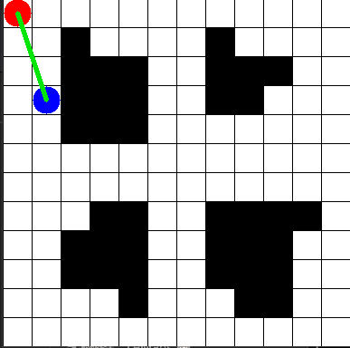
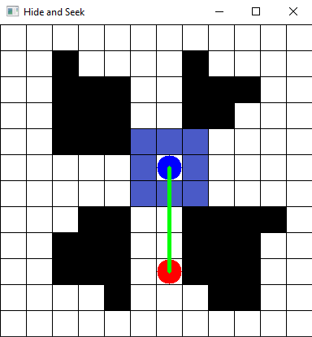
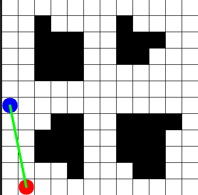
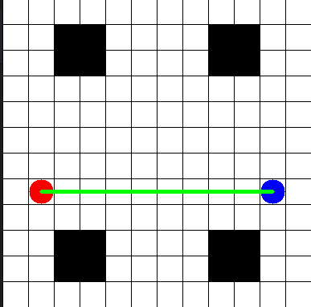
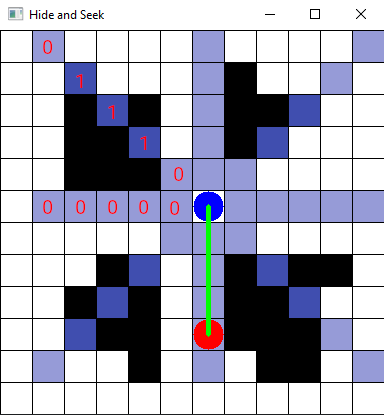
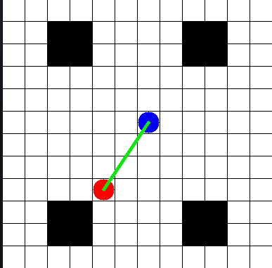

# Hide and Seek

## Requirements
- stable_baselines3 v2.0.0a13
- gymnasium 0.28.1
- tensorboard 2.13.0

## How to deploy
TODO

## Architecture
TODO

## Notes on the building of this AI

Below are notes explaining all my thoughs that led to the building of this Hide and Seek AI.

While getting used to stable baselines 3 (SB3) and gymnasium libraries, I first tried to make a basic AI to see the learning process. 

Reinforcement learning (RL) environments must define five things:
- the action space: the actions the agent can make. In our case there are four actions (go UP, LEFT, DOWN, or RIGHT)
- the observation space: what the agent can see, the information it has to learn the task. Give not enough or way too much information and it will be hard or impossible for the AI to learn anything. 
- a termination condition: when the task is considered done. In our case, the task is done when the agent is hidden from the player.
- a truncation condition: when the task is considered failed. In our case, the task is failed after 300 steps.
- the reward given to the agent: the reward is the information given to the agent to tell him if he is doing good or not. The agent will try to maximise the reward. In our case, the reward is 50 if the agent is hidden (win), -1 for each step (to encourage the agent to finish the task quickly) if seen by the player.

The action space is fixed by our task. However, we can decide how we want to define our observation space. In other terms, **what information do we want to give to our AI?**. This way we can try to have our expected behaviour of hiding from the player..

### Learn to run away (`BasicObservation`)

The basic observation space that we can define is give the AI the minimum of information possible:
- the player position (x,y) on the grid
- the agent position (x,y) on the grid
- is the agent seen or not (0 or 1)

This observation space is of shape `(5,)`.

This way, the AI can learn to run away from the player. However, it will just happend to be hidden "by chance" by trying to escape from the player. It will not really learn to hide on purpose. Indeed, the AI has yet no knowledge of the map, and more particularly of the walls. It will just try to run away from the player, and if it happens to be hidden, it will be a coincidence:

<!-- GIF of AI with Basic Observation strategy -->

### Learn to hide (`ImmediateSurroundngsObservation`)
In order to improve the previous AI, it is possible to give more information to the AI. We can give it the information of the immediate surroundings of the agent. This way, the AI can see if the surroundings contain walls and will learn to move differently if there are wall nearby or not.

The observation space is now the same as before but with the addition of:
- is the surrounding cell (including diagonals) a wall or not (0 or 1)

(Although the AI cannot move diagonally, it can still see if there is a wall in the diagonal cell, to help planning a path).

This observation space is of shape `(5+8,)`.

<!-- Image of AI + observation space -->

Now we can observe that the agent is more actively trying to hide. It will not just run away from the player, but may turn directly when encountering walls on the surroundings:

<!-- GIF of AI with Immediate Surroundings Observation strategy -->

This strategy however has some limitations. The AI will not be able to properly hide in maps with walls/hiding places that are far away, as they won't be in the immediate surroundings. The AI will not be able to plan a path to go to these places. It will just try to run away from the player, and if it happens to be close to a wall, it will be a coincidence:

<!-- GIF of AI with Immediate Surroundings Observation strategy on map few_walls-->

### Learn to hide by seeing (`LongViewObservation`)

The problem with the previous observation space is that the AI is short-sighted. It can only see the immediate surroundings. It cannot plan a path to go to a far away wall. To tackle this problem, the agent must see more of the environment. Instead of seeing the surroundings of size X, to not have a big dimension of the observation space, the agent will see in straight lines in 8 directions. This can be seen as sensors that give proximity info to the AI.

The observation space is now:
- the player position (x,y) on the grid
- the agent position (x,y) on the grid
- is the agent seen or not (0 or 1)
as before, but with the addition of:
- for each 8 directions, is there a wall at size 1, 2, ..., view_size (0 or 1)

This observation space is of shape `(5+8*view_size,)`.

If view_size = 1, this is equivalent to the `ImmediateSurroundngsObservation` strategy. By default, this strategy is set to view_size = 5.

<!-- Image of AI + observation space with view_size = 5 -->

Now, in maps with walls that can be far away, the agent will be able to "sense" them and plan where to hide:

<!-- GIF of AI with Long View Observation strategy on map few_walls-->
